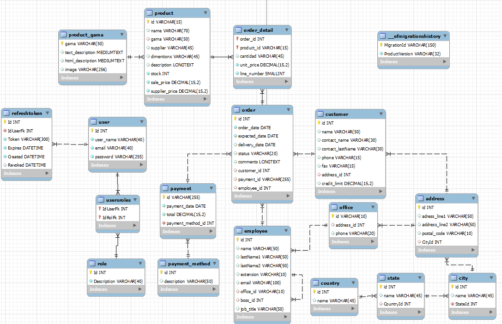

### Uso de Json Web Token
Ya que los usuarios se cargan  en la base de datos por medio de "Data Seeding". En Entity Framework Core, se utiliza para prellenar la base de datos con datos iniciales durante las migraciones. Para este proyecto se optó por dejar sin autorización los controladores que tienen enpoints por mayor facilidad. 

Los datos necesarios para poder hacer post a los endpoints de JWT y en general se encuetran más facilmente en el Swagger, que se incializa por medio de dotnet watch run.

Nota: He tenido inconvenientes con la autorización, ya que, en vez de lanzarme la respuesta 401 o 403, me lanza 404 Not found, pero si le pasamos en token igualmente funcionará.

Si el token caduca, el programa esta diseñado para que por medio de su refresh token pueda generar otro.

Tomamos el refresh token, creamos la cookie y apartir de ese refresh token se generan nuevos tokens
Si el token expira podemos generar cuantos queramos con el mismo refresh token. Si el refresh token expira se debe generar otro token desde el endpoint token.

- Duración del refresh token: 1 hora
- Duración del token de acceso: 1 minuto
Si se presentan inconvenientes a la hora de generar un nuevo token desde el refresh token hay que borrar las cookies.


### NORMALIZACIÓN  



#### Pasos para el volcado de datos a la bd
1. Para este proyecto se requiere el uso de mySql Workbench
2. Entra a Api y ejecuta el comando dotnet run, si no funciona puedes hacer uso del script Update para que ef convierta tu estructura orienta a objetos a una tabular en la bd.
3. Una tengas las tablas que vas a usar y que todo salió bien, puedes hacer el volcado de datos dirigiendote a [Datos](./Datos.md)
- Una vez adentro de Datos puedes hacer ctrl + A para copiar todo el texto.
- Vas a Workbench y elijes la bd llamada jardineria2, abres un archivo SQL y le das a ctrl + V
- Señala todos los datos con ctrl + A y le das al rayo que apartece en el menú de ejecución que se encuentra en la parte superior del archivo
- Y ya quedaría el volcado de datos echo.

## CONSULTAS

1. Devuelve un listado con el nombre de los todos los clientes 
españoles.
```
/API/customer/GetByCountry/{country}
```

2. Devuelve un listado con los distintos estados por los que puede pasar un
pedido.
```
/API/Order/GetAllStatus
```

3. Devuelve un listado con el código de cliente de aquellos clientes que
realizaron algún pago en 2008. Tenga en cuenta que deberá eliminar
aquellos códigos de cliente que aparezcan repetidos. Resuelva la consulta:
• Utilizando la función YEAR de MySQL.
• Utilizando la función DATE_FORMAT de MySQL.
• Sin utilizar ninguna de las funciones anteriores.
```
/API/Customer/GetIdByPaymentDate/2009
```

9. Devuelve un listado con el código de pedido, código de cliente, fecha
esperada y fecha de entrega de los pedidos que no han sido entregados a
tiempo.

```
/API/Order/GetAllNotDeliveredOnTime
```
10. Devuelve un listado con el código de pedido, código de cliente, fecha
esperada y fecha de entrega de los pedidos cuya fecha de entrega ha sido al
menos dos días antes de la fecha esperada.

• ¿Sería posible resolver esta consulta utilizando el operador de suma + o
resta -? -yes
```
/API/Order/GetAllDeliveredEarlier
```
ENPOINT CON VERSIONADO (se busca por medio del id):
```
 API/order/GetAllDeliveredEarlier?ver=1.1
```

11. Devuelve un listado de todos los pedidos que fueron (X status) en X.
```
/API/Order/GetOrderByStatusYear/{status}/{year}
```

12. Devuelve un listado de todos los pedidos que han sido entregados en el mes de enero de cualquier año.
```
/API/Order/GetAllByMonth/{status}/{ej:enero}
```
13. Devuelve un listado con todos los pagos que se realizaron en el
año X mediante X. Ordene el resultado de mayor a menor.
```
API/Payment/GetByPaymentMethodYear/{PaymentMethod}/{year}
```
14. Devuelve un listado con todas las formas de pago que aparecen en la tabla pago. Tenga en cuenta que no deben aparecer formas de pago repetidas.
Nota:Con la normalizacion de la tabla Paymenthod no fue necesario crear logica en el repo, ni controlador, solo bastó llamar al metodo generico GetAllAsync
```
/API/PaymentMethod
```

15. Devuelve un listado con todos los productos que pertenecen a la gama X y que tienen más de X unidades en stock. El listado
deberá estar ordenado por su precio de venta,mostrando en primer lugar los de mayor precio.
```
/API/Product/GetByGamaStock/{gama}/{unidades}
```
16. Devuelve un listado con todos los clientes que sean de la ciudad X y cuyo representante de ventas tenga el código de empleado X o X.
1.4.5 Consultas multitabla (Composición interna)
Resuelva todas las consultas utilizando la sintaxis de SQL1 y SQL2. Las consultas con
sintaxis de SQL2 se deben resolver con INNER JOIN y NATURAL JOIN.
```
/API/customer/GetByCityEmployee/{ciudad}/{idEmployee1}/{idEmployee2}
```
1. Obtén un listado con el nombre de cada cliente y el nombre y apellido de su representante de ventas.
```
/API/customer/GetNameAndEmployee
```

2. Muestra el nombre de los clientes que hayan realizado pagos junto con el nombre de sus representantes de ventas.
```
/API/customer/GetByOrderEmployee
```
3. Muestra el nombre de los clientes que no hayan realizado pagos junto con
el nombre de sus representantes de ventas.
```
/API/customer/GetByOrderNotPaymentEmployee
```
4. Devuelve el nombre de los clientes que han hecho pagos y el nombre de sus
representantes junto con la ciudad de la oficina a la que pertenece el
representante.
```
/API/customer/GetByOrderPaymentEmployee
```
ENPOINT CON VERSIONADO (se busca por medio del Name):
```
/API/customer/GetByOrderPaymentEmployee?ver=1.1
```

5. Devuelve el nombre de los clientes que no hayan hecho pagos y el nombre
de sus representantes junto con la ciudad de la oficina a la que pertenece el representante.
```
/API/customer/GetByOrderNotPaymentEmployeeCity
```
6. Devuelve un listado que muestre el nombre de cada empleado, el nombre
de su jefe y el nombre del jefe de su jefe.
```
/API/employee/GetNameAndBossChief
```
7. Devuelve el nombre de los clientes a los que no se les ha entregado a
tiempo un pedido.
```
/API/customer/GetNameNoDeliveryOnTime
```
8. Devuelve un listado de las diferentes gamas de producto que ha comprado
cada cliente.
```
/API/productGama/GetByProductGama
```


1.4.6 Consultas multitabla (Composición externa)
Resuelva todas las consultas utilizando las cláusulas LEFT JOIN, RIGHT JOIN, NATURAL
LEFT JOIN y NATURAL RIGHT JOIN.

1. Devuelve un listado que muestre solamente los clientes que no han
realizado ningún pago.
```
/API/customer/GetByOrderNotPaid
```
ENPOINT CON VERSIONADO (se busca por medio del id):
```
 API/customer/GetByOrderNotPaid?ver=1.1
```

2. Devuelve un listado que muestre los clientes que no han realizado ningún pago y los que no han realizado ningún pedido.
```
/API/customer/GetByNotPaidAndNotOrder
```
3. Devuelve un listado que muestre solamente los empleados que no tienen un
cliente asociado junto con los datos de la oficina donde trabajan.
```
/API/Employee/GetNotAssociatedEmployeeOffice
```
4. Devuelve un listado que muestre los empleados que no tienen una oficina asociada y los que no tienen un cliente asociado.
```
/API/Employee/GetNotAssoEmployeeAndOffice
```
5. Devuelve un listado de los productos que nunca han aparecido en un pedido.
```
/API/product/GetNeverInOrder
```
6. Devuelve un listado de los productos que nunca han aparecido en un pedido. El resultado debe mostrar el nombre, la descripción y la imagen del producto.
```
/API/product/GetNeverInOrderspecified
```
7. Devuelve las oficinas donde no trabajan ninguno de los empleados que hayan sido los representantes de ventas de algún cliente que haya realizado la compra de algún producto de la gama X.

```
/API/office/GetByEmployeeWithProductGama/{gama}
```

8. Devuelve un listado con los clientes que han realizado algún pedido pero no han realizado ningún pago.
Se reutiliza el metodo del enpoint (1. Devuelve un listado que muestre solamente los clientes que no han realizado ningún pago) ya que en la normalización se liga el pago a la orden, y sin orden no hay pago.
```
/API/customer/GetByOrderNotPaid
```

9. Devuelve un listado con los datos de los empleados que no tienen clientes asociados y el nombre de su jefe asociado.
```
/API/employee/GetNotAssoCustomerBossName
```
1.4.7 Consultas resumen
1. ¿Cuántos empleados hay en la compañía?
```
/API/employee/GetEmployeesQuantity
```
2. ¿Cuántos clientes tiene cada país?
```
/API/country/GetCustomersQuantityByCountry
```
3. ¿Cuál fue el pago medio en X año?
```
/API/order/GetOrderPaymentAverangeInYear/{year}
```
4. ¿Cuántos pedidos hay en cada estado? Ordena el resultado de forma
descendente por el número de pedidos.
```
/API/order/GetOrdersQuantityByStatus
```
5. ¿Cuántos clientes existen con domicilio en la ciudad de Madrid?
```
/API/customer/GetByCustomerQuantityInCity/madrid city
```
6. ¿Calcula cuántos clientes tiene cada una de las ciudades que empiezan por X?
```
/API/customer/GetByCustomerQuantityInLetterCity/{letter}
```
7. Devuelve el nombre de los representantes de ventas y el número de clientes al que atiende cada uno.
```
/API/employee/GetEmployeesCustomerQuantity
```
8. Calcula el número de clientes que no tiene asignado representante de
ventas.
```
/API/customer/GetByNotAssignedEmployee
```
9. Calcula la fecha del primer y último pago realizado por cada uno de los clientes. El listado deberá mostrar el nombre y los apellidos de cada cliente.
```
/API/customer/GetFirstLastPaymentByCustomer
```
10. Calcula el número de productos diferentes que hay en cada uno de los pedidos.
```
/API/order/GetByDifferentProdQuantity
```
11. Calcula la suma de la cantidad total de todos los productos que aparecen en
cada uno de los pedidos.
```
/API/order/GetTotalSumProdInOrder
```
12. Devuelve un listado de los 20 productos más vendidos y el número total de unidades que se han vendido de cada uno. El listado deberá estar ordenado por el número total de unidades vendidas.
```
/API/order/GetMostSold
```
13. La misma información que en la pregunta anterior, pero agrupada por
código de producto.
```
/API/order/GetMostSoldGroupedByCod
```
14. La misma información que en la pregunta anterior, pero agrupada por
código de producto filtrada por los códigos que empiecen por X.
```
/API/order/GetMostSoldGroupedByCodFiltered/OR
```
15. Lista las ventas totales de los productos que hayan facturado más de X
euros. Se mostrará el nombre, unidades vendidas, total facturado y total
facturado con impuestos (21% IVA).
```
/API/order/GetTotalSaleByQuantityRange/{range}
```

16. Muestre la suma total de todos los pagos que se realizaron para cada uno
de los años que aparecen en la tabla pagos.
```
/API/order/GetOrderTotalSumByYear
```

** 1.4.8 Subconsultas
1.4.8.1 Con operadores básicos de comparación
1. Devuelve el nombre del cliente con mayor límite de crédito.
```
/API/customer/GetByGreatestCreditLimit
```
2. Devuelve el nombre del producto que tenga el precio de venta más caro.
```
/API/product/GetByHigherSalesPrice
```
3. Devuelve el nombre del producto del que se han vendido más unidades.
(Tenga en cuenta que tendrá que calcular cuál es el número total de unidades que se han vendido de cada producto a partir de los datos de la tabla detalle_pedido)
```
/API/product/GetByHigherSalesPrice
```
4. Los clientes cuyo límite de crédito sea mayor que los pagos que haya
```
API/customer/GetByHigherCreditLimitThanPayment
```
realizado. (Sin utilizar INNER JOIN).

1.4.8.2 Subconsultas con ALL y ANY

//8. Devuelve el nombre del cliente con mayor límite de crédito. En linq tanto Any como All esperaran una condicion para hacer un filtro, no vi manera de solucionarlo con alguno de estos metodos.

```
/API/customer/GetByGreatestCreditLimit
```
9. Devuelve el nombre del producto que tenga el precio de venta más caro.En linq tanto Any como All esperaran una condicion para hacer un filtro, no vi manera de solucionarlo con alguno de estos metodos.
```
/API/product/GetByHigherSalesPrice
```

1.4.8.3 Subconsultas con IN y NOT IN
11. Devuelve un listado que muestre solamente los clientes que no han
realizado ningún pago.
```
/API/customer/GetByNotOrder
```
12. Devuelve un listado que muestre solamente los clientes que sí han realizado algún pago.
```
/API/customer/GetByOrderPaid
```
13. Devuelve un listado de los productos que nunca han aparecido en un
pedido.
```
/API/product/GetByNotInOrder
```
14. Devuelve el nombre, apellidos, puesto y teléfono de la oficina de aquellos
empleados que no sean representante de ventas de ningún cliente.
```
/API/employee/GetEmployeesWithoutOrder
```
1.4.8.4 Subconsultas con EXISTS y NOT EXISTS
ya que se puede usar las mismas rutas que los anteriores enpoints, no haré los enpoints, sino que, haré la lógica SQL
```
18. Devuelve un listado que muestre solamente los clientes que no han
realizado ningún pago.
Select * From jardineria.customer c
WHERE Exist 
( 
    Select 1 From jardineria.order o
    where c.Id = o.customer_Id AND
    o.Payment_Id IS NOT NULL
)
```
19. Devuelve un listado que muestre solamente los clientes que sí han realizado
algún pago.
```
SELECT * FROM jardineria.Customer c
WHERE NOT EXIST
(
    SELECT 1 FROM Order o
    WHERE c.Id = o.Customer_id
    AND o.Payment_Id IS NOT NULL
)

```
1.4.9 Consultas variadas
1. Devuelve el listado de clientes indicando el nombre del cliente y cuántos
pedidos ha realizado. Tenga en cuenta que pueden existir clientes que no
han realizado ningún pedido.
```
/API/customer/GetNameAndOrdersQuantity
```
ENPOINT CON VERSIONADO (se busca por medio del id):
```
API/customer/GetNameAndOrdersQuantity?ver=1.1
```

2. Devuelve el nombre de los clientes que hayan hecho pedidos en X
ordenados alfabéticamente de menor a mayor.
```
API/customer/GetByOrderInYear/{year}
```
3. Devuelve el nombre del cliente, el nombre y primer apellido de su
representante de ventas y el número de teléfono de la oficina del
representante de ventas, de aquellos clientes que no hayan realizado ningún
pago.
```
/API/customer/GetDataAndEmployee
```
4. Devuelve el listado de clientes donde aparezca el nombre del cliente, el
nombre y primer apellido de su representante de ventas y la ciudad donde
está su oficina.
```
/API/customer/GetDataAndEmployeeCity
```
5. Devuelve el nombre, apellidos, puesto y teléfono de la oficina de aquellos
empleados que no sean representante de ventas de ningún cliente
```
/API/employee/GetDataByJobTitle
```
